# 🌸 Guía Maestra de la Plataforma luu.
### *Manual Operativo y Walkthrough Oficial para Francisca y Jorge (Dueños del Salón)*
**Versión**: Plataforma luu. Beauty-Tech v3.0 Multi-Salón

---

## 🌟 Estimados Francisca y Jorge:

Esta plataforma (**luu.**) ha sido concebida y desarrollada como un ecosistema integral de gestión para salones de belleza de alta gama. Su objetivo es doble:
1. **Para ustedes como dueños**: Otorgarles visibilidad financiera total (ventas, ticket promedio, comisiones de equipo, inventario e ingresos retail), control de sucursales y automatización de marketing sin fricción.
2. **Para sus estilistas y clientas**: Entregar una experiencia de atención fluida, sin esperas confusas, con fichas técnicas seguras y un portal de auto-reserva digital de nivel premium.

A continuación encontrarán el desglose minucioso de **todos los módulos, opciones, herramientas y flujos de trabajo**, actualizado al 100% con la última versión del sistema.

---

## 🗺️ Arquitectura de la Plataforma

La aplicación se estructura en 4 niveles de operación:

```mermaid
graph TD
    A[Plataforma luu. Multi-Salón] --> B[1. Seguridad & Multisede]
    A --> C[2. Operación de Salón & Clientes]
    A --> D[3. Punto de Venta & Negocio]
    A --> E[4. Herramientas Especializadas & Portal]

    B --> B1[🏢 Sedes: Vitacura / Providencia / Nuevas]
    B --> B2[🔐 Perfiles: Dueño / Estilista / Recepción]
    B --> B3[🎨 Paletas Cromáticas v3.0]

    C --> C1[📅 Agenda & Check-In en Sala]
    C --> C2[💇‍♀️ Peluqueras: Estación & Comisiones]
    C --> C3[🪑 Mapa de Sillones en Vivo]
    C --> C4[👥 Clientes, Fórmulas & Beauty Pass]
    C --> C5[✂️ Servicios, Tiempos & Tarifas]

    D --> D1[💳 Checkout & Encuesta NPS WhatsApp]
    D --> D2[📦 POS Retail con Lector de Código de Barras]
    D --> D3[🤖 Agente IA de Fichas de Producto]
    D --> D4[✨ Automatizaciones WhatsApp por Ciclo Biológico]
    D --> D5[📊 Métricas, Peak Hours & Reporte Financiero]

    E --> E1[📱 Portal Móvil de Auto-Reserva]
    E --> E2[⚖️ Báscula de Mezclas de Colorimetría]
    E --> E3[🪞 Comparador Antes vs Después]
    E --> E4[⚡ Paleta de Comandos Cmd + K]
```

---

## 1. 🏢 Multi-Sucursal, Acceso Seguro & Personalización

### A. Soporte Multi-Salón (Tenant Switching)
* En la esquina superior derecha, dentro del menú de usuario, pueden **conmutar de sucursal con un solo clic** (por ejemplo: pasar de *luu. Vitacura* a *luu. Providencia*).
* Permite registrar nuevas sucursales de forma ilimitada (indicando nombre, ciudad, teléfono y dirección), manteniendo las bases de datos de citas, clientes y stock segmentadas por local.

### B. Inicio de Sesión y Control de Roles
* **Acceso Directo**: Inicio de sesión rápido con Google o mediante Email y Contraseña.
* **Modos de Visualización**:
  * **Modo Dueño / Administrador**: Acceso irrestricto a caja, configuración de tarifas, inventario, comisiones porcentuales y analítica global.
  * **Modo Estilista**: Diseñado para tablets en cada estación o el teléfono de la peluquera, mostrando solo sus clientas del día, recetas de color y tiempos de atención.
  * **Modo Cliente**: Simula la experiencia que viven sus clientas al reservar.

### C. Paletas Cromáticas de Lujo (Theme Switcher)
En la barra superior disponen de 4 estéticas visuales modernas para adaptar el look del salón según la temporada:
* 🌸 **Rhode Sunset**: Tonos terracota cálidos y melocotón glow.
* 🍵 **Matcha & Pistachio**: Estilo *clean girl*, tonos verdes botánicos y spa.
* 💜 **Electric Lilac**: Sofisticación en lavanda, orquídea y ciruela velvet.
* ✨ **Noir Luxury**: Elegancia contemporánea en obsidiana y oro champagne.

---

## 2. 📅 Agenda & Check-In en Sala (Recepción Inteligente)

### Opciones y Capacidades:
* **Citas Combinadas (Multi-Servicio)**: Agenden en una misma cita varios servicios continuos con diferentes especialistas (ej: *Balayage con Valentina Morales* + *Manicura Permanente con Camila Soto*). El sistema calcula la duración total y la suma de precios.
* **Control de Asistencia & Check-In**:
  * Botón **"Check-In"** al llegar la clienta al local: pasa a estado `"En Sala de Espera"` en verde esmeralda parpadeante y muestra el tiempo exacto que lleva esperando.
  * Botón **"Iniciar Atención"**: cambia a `"En Atención"` (indicando con ícono activo que está en el sillón).
  * Estados automáticos: `Confirmada`, `En Sala de Espera`, `En Atención`, `Finalizada & Cobrada`.
* **Añadir Servicios en Caliente**: Si la clienta en pleno corte o color pide un masaje capilar o secado adicional, el botón *"Añadir Servicio"* lo suma al instante a la orden sin reiniciar la cita.
* **Filtros en Tiempo Real**: Visualicen el salón completo o filtren por un estilista específico para ver su ocupación.
* **KPIs Diarios en Cabecera**: Conteo de citas del día, personas en sala, servicios concluidos y total facturado al momento.

---

## 3. 💇‍♀️ Peluqueras & Estaciones (Gestión de Equipo & Comisiones)

Este módulo se divide en dos secciones operativas indispensables:

### Pestaña 1: "Estación de Trabajo" (Día a Día del Estilista)
* Selector rápido de profesional (ej: *Valentina Morales*, *Camila Soto*, *Javiera Silva*).
* Despliega la lista cronológica de sus atenciones de hoy.
* Permite hacer check-in, iniciar servicio, registrar fórmulas técnicas y abrir el cobro en caja.

### Pestaña 2: "Equipo & Comisiones" (Control para Francisca y Jorge)
* **Directorio de Profesionales**: Alta, edición y baja de estilistas con nombre, cargo (*Colorista Master*, *Manicurista Senior*), especialidades y color identificador.
* **Tasa de Comisión (% Variable)**: Configuración personalizada de la comisión para cada profesional (ej: 40%, 45%, 50%).
* **Liquidación Instantánea de Ganancias**: Calcula automáticamente:
  * Total de servicios realizados.
  * Facturación bruta generada por el profesional.
  * Comisión exacta a pagar en el día o período.
  * Promedio de satisfacción y evaluación de sus clientas (estrellas).

---

## 4. 🪑 Mapa de Sillones en Vivo (Salon Floor Plan)

Vista arquitectónica interactiva para supervisar la planta del salón en tiempo real:

* **Estaciones Mapeadas**:
  1. *Sillón 1*: Colorimetría & Balayage.
  2. *Sillón 2*: Corte de Autor & Styling.
  3. *Estación 3*: Lavacabezas & Spa Capilar.
  4. *Mesa 4*: Manicura Rusa & Nail Art.
  5. *Estación 5*: Pestañas & Cejas.
* **Estados en Vivo**:
  * 🔴 **Ocupado**: Muestra qué clienta está sentada, qué servicio se le está aplicando, qué profesional la atiende y un **contador regresivo con los minutos restantes de exposición** (tiempo de pose).
  * 🟢 **Disponible / Listo**: Sillón libre y preparado para la siguiente clienta.
  * 🟡 **En Sanitización**: Tiempo de limpieza e higienización entre turnos.
* Al presionar cualquier sillón se abre la ficha de la clienta o el detalle de su cita.

---

## 5. 👥 Clientes, Fichas Técnicas & Beauty Pass

La memoria histórica y el recetario confidencial del salón.

### Funcionalidades:
* **Buscador Inteligente**: Localiza de inmediato por nombre, número de WhatsApp o correo electrónico.
* **Etiquetas Automáticas de Comportamiento**: Segmentación en `VIP`, `Frecuente`, `Nuevo`, `Inactivo`, `Color Raíz` y `Manicura Lover`.
* **Ficha Técnica & Recetario Confidencial**:
  * **Colorimetría**: Gramos de tinte base, tinte secundario, volúmenes de oxidante (10, 20, 30, 40 Vol), proporción de mezcla (ratio 1:1, 1:1.5, 1:2), tiempo de pose y matizador aplicado.
  * **Uñas**: Base rubber, marca y código de esmalte, técnica de manicura y detalles de nail art.
  * **Candado de Privacidad**: Las fórmulas pueden marcarse como privadas para resguardar las recetas maestras del salón.
  * **Galería Fotográfica**: Registro visual de cada resultado (antes y después).
* **👑 Beauty Pass (Club VIP Digital)**:
  * Tarjeta virtual de fidelización con código QR y puntos acumulados por visitas.
  * Botón **"Compartir Pass"**: copia el enlace directo para enviarlo a la clienta por WhatsApp.

---

## 6. ✂️ Servicios & Tarifas (Catálogo y Ciclos de Mantención)

Módulo exclusivo para configurar la oferta comercial del salón:

* **Categorías Soportadas**:
  * 💇‍♀️ *Cabello & Color*
  * 💅 *Uñas & Manicura*
  * ✨ *Cejas & Pestañas*
  * 🌸 *Cuidado Facial*
  * 🧖‍♀️ *Masajes & Spa*
* **Parámetros por Servicio**:
  * Nombre, descripción comercial y categoría.
  * **Duración en minutos**: Define el tiempo que bloqueará en la agenda.
  * **Precio al público**: Tarifa base del servicio.
  * **Días de Recurrencia Recomendada**: Define el ciclo biológico de mantención (ej: 14 días para manicura, 25 días para retoque de raíces, 45 días para corte). Este parámetro es el que alimenta las campañas automáticas de WhatsApp.

---

## 7. 💳 Punto de Cobro (Checkout) & Protocolo de Rectificación

### Experiencia de Cierre de Atención:
1. **Consolidación**: Carga automática de los servicios agendados y agregados durante la visita.
2. **Venta Cruzada Retail**: Añadan productos de cuidado en casa (shampoo, sérum, aceites) directamente en la cuenta.
3. **Formas de Pago**: Tarjeta de Crédito, Débito, Transferencia bancaria o Efectivo.
4. **Propinas y Descuentos**: Cálculo desglosado y transparente.
5. **Guardado de Fórmula Rápida**: Pueden ingresar la fórmula usada y subir la foto del resultado en el mismo instante del cobro.

### 🛡️ Encuesta WhatsApp & Protocolo de Rectificación:
* Tras cerrar la venta, el sistema envía una **encuesta de satisfacción** (1 a 5 estrellas) al WhatsApp de la clienta.
* **Alerta Inmediata si la Nota es Baja (1 a 3 Estrellas)**: El sistema activa una alerta roja prioritaria y sugiere un mensaje de contacto directo para que Francisca o Jorge se comuniquen con la clienta, ofrezcan una solución o rectificación y salven la relación antes de que exprese su molestia públicamente.

---

## 8. 📦 Productos, Inventario Inteligente & POS Retail

Este módulo transforma los productos del salón en una unidad de negocio rentable y automatizada.

### 4 Sub-Pestañas:
1. **Punto de Venta Retail (POS)**:
   * Carrito de compras veloz con cálculo de vuelto, descuentos y medios de pago.
   * **Soporte para Pistolas Lectoras de Código de Barras**: Compatible con cualquier escáner físico USB o inalámbrico Bluetooth. Emite un agradable **sonido "bip"** sintetizado (Web Audio API) al detectar el código.
   * **Escáner por Cámara**: Si no tienen pistola física, pueden usar la cámara de su laptop o celular para leer códigos de barras.
   * **Comisión por Venta Retail**: Permite seleccionar a la estilista que recomendó el producto para pagarle su comisión por venta de retail.
   * **Emisión de Recibo Digital**: Ticket térmico listo para imprimir o enviar.
2. **Catálogo & Enriquecimiento con IA (aiProductAgent)**:
   * Listado visual de productos (Moroccanoil, Olaplex, Kérastase, Wella, OPI).
   * **Botón Mágico de IA**: Al registrar un producto nuevo o ingresar su código, la Inteligencia Artificial completa en segundos el nombre oficial, descripción persuasiva, beneficios clave, ingredientes activos y modo de empleo.
3. **Control de Stock & Alertas Críticas**:
   * Semáforo de stock (óptimo, por agotarse, crítico).
   * Botón de reposición rápida (+10 o cantidad deseada).
   * **Generador Automático de Orden de Reposición**: Redacta el pedido con las cantidades faltantes y permite enviárselo directamente al proveedor por WhatsApp con un solo clic.
4. **Historial de Ventas**: Registro auditable de todas las ventas minoristas realizadas, con fecha, hora, productos, medios de pago y totales.

---

## 9. ✨ Fidelización Automatizada & Simulador WhatsApp

### Motores de Disparo Automático:
* **Ciclo Biológico del Servicio**:
  * 💅 *Uñas permanentes*: Alerta a los 14 días.
  * 🎨 *Retoque de raíces*: Alerta a los 25 días.
  * 💇‍♀️ *Corte y nutrición*: Alerta a los 45 días.
* **Cumpleaños de Clientas**: Saludo automático con cupón de regalo (ej: 20% de descuento durante el mes).
* **Recuperación de Inactivas**: Detección de clientas con más de 45 días sin agendar y envío de una invitación personalizada con un masaje capilar de cortesía.

### 📱 Simulador de WhatsApp en Vivo:
* En cualquier momento pueden abrir el simulador desde la barra superior o desde el módulo de marketing.
* Emula un teléfono móvil real con chat interactivo para que Francisca y Jorge previsualicen exactamente cómo leerá el mensaje su clienta antes de dispararlo.

---

## 10. 📊 Métricas Operativas & KPIs Financieros

Panel analítico para la toma de decisiones estratégicas:

* **Facturación Global & Ticket Promedio**: Seguimiento del consumo promedio por visita.
* **Distribución de Días de Mayor Demanda**: Identifica con barras porcentuales los días pico (ej. viernes y sábados al 100%) para dimensionar correctamente el personal.
* **Horarios Punta (*Peak Hours*)**:
  * 10:00 - 12:00 (Mañanas: Color y Balayage).
  * 12:00 - 15:00 (Mediodía: Cortes y Manicura).
  * 16:00 - 19:30 (Tardes: Ocupación máxima post-oficina).
* **Tabla de Rendimiento por Estilista**: Comparativa de atenciones, ingresos generados, comisiones ganadas y nota promedio de satisfacción.

---

## 11. 🛠️ Herramientas de Autor para Profesionales

Herramientas disponibles en la barra superior y atajos globales:

| Herramienta | Función Principal | Valor para el Salón |
| :--- | :--- | :--- |
| ⚖️ **Calculadora de Ratios de Color** | Calcula gramos exactos de oxidante según el peso de tinte base y secundario (ratios 1:1, 1:1.5, 1:2) y volúmenes (10, 20, 30, 40 Vol). | Elimina el desperdicio de insumos caros y garantiza que el color quede idéntico siempre. |
| 🪞 **Comparador Antes / Después** | Slider interactivo que superpone la foto del cabello o uñas al llegar vs al finalizar el servicio. | Genera material visual de alto impacto para compartir en WhatsApp o Instagram Stories. |
| ⚡ **Paleta de Comandos (`Cmd + K`)** | Buscador universal rápido accesible con teclado desde cualquier pantalla. | Permite agendar, buscar una clienta o abrir herramientas en menos de 2 segundos. |

---

## 12. 📱 Portal Móvil de Auto-Reserva para Clientes

Experiencia *mobile-first* lista para compartir en el link de la biografía de Instagram (`bio`) o enviar por WhatsApp:

* **Paso 1**: La clienta elige los servicios deseados con fotos, duración y precios transparentes.
* **Paso 2**: Selecciona a su profesional preferido o elige *"Cualquiera disponible"*.
* **Paso 3**: Escoge fecha en el calendario interactivo y horario disponible en tiempo real.
* **Paso 4**: Ingresa su nombre y WhatsApp, recibiendo confirmación inmediata con su código de reserva.
* La cita impacta de inmediato en la Agenda y en el Mapa de Sillones del salón.

---

## 🎯 Recomendación de Puesta en Marcha para Francisca y Jorge

1. **Configuración de Servicios y Tarifas**: Revisar en el menú *Servicios & Tarifas* que los precios, duraciones y días de ciclo de mantención reflejen la carta de su salón.
2. **Definición de Equipo**: En *Peluqueras & Estación*, verificar que cada profesional tenga configurada su comisión acordada.
3. **Recepción en Tablet o PC**: Mantener en la recepción la pantalla de *Agenda & Citas* o *Mapa de Sillones* para realizar el Check-in al instante en que una clienta cruce la puerta.
4. **Activación de Campañas**: Dejar encendidas las campañas de WhatsApp en *Fidelización* para asegurar la recompra continua y llenar los horarios de menor afluencia.
